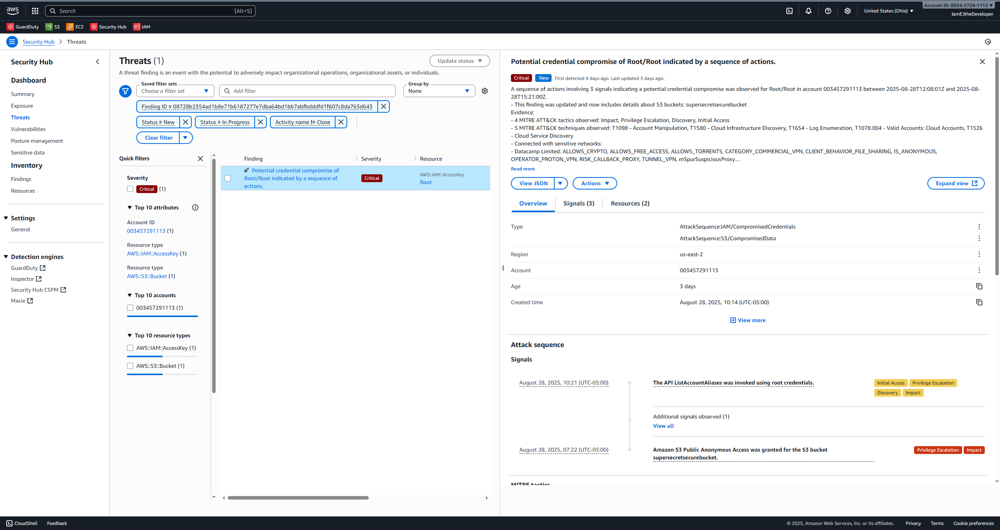
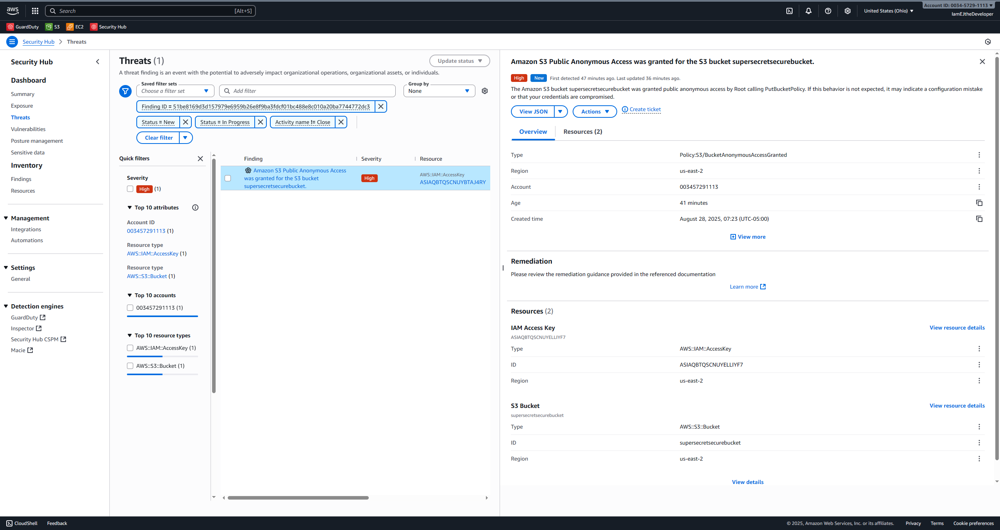
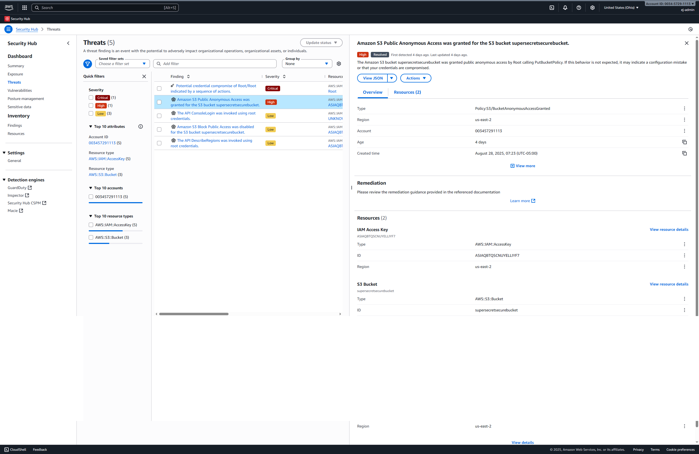

# Project Title: AWS Security Hub & GuardDuty Lab

## Objective
This project demonstrates the hands-on ability to use native AWS security services (Security Hub, GuardDuty) to detect, analyze, and remediate both infrastructure misconfigurations and potential account compromises. These scenarios assume both accidental AWS misconfigurations and a simulated breach, providing a comprehensive overview of a cloud security analyst's workflow.

## Tools & Technologies Used

* **AWS Security Hub:** For centralizing, managing, and analyzing security findings.
* **Amazon GuardDuty:** For intelligent, behavior-based threat detection across the AWS environment.
* **Amazon S3:** Used to create and remediate a common storage misconfiguration (public bucket).
* **AWS EC2:** Used to create and remediate a common network misconfiguration (insecure security group).
* **AWS IAM:** For understanding and implementing identity and access management best practices.
* **Markdown:** For creating the final project report.

---
## Project Walkthrough

In this section, I will detail the four phases of the lab: setting up the environment, introducing vulnerabilities, using AWS tools to detect and analyze the findings, and finally, remediating the risks.

### Phase 1: Setup & Baseline
The initial phase involved enabling and configuring core AWS security services to establish a monitoring baseline. AWS Security Hub was enabled to centralize security findings, and Amazon GuardDuty was activated for intelligent threat detection. An initial scan confirmed a secure starting posture for the environment before any vulnerabilities were introduced.

### Phase 2: Introducing Vulnerabilities
This phase involved the intentional introduction of two common, high-risk misconfigurations into the AWS environment to simulate a real-world security scenario.

* An **Amazon S3 bucket** was configured for public access by disabling the "Block Public Access" setting and applying a public-read bucket policy.
* An **EC2 Security Group** was created with an inbound rule allowing unrestricted SSH access (Port 22) from any IP address (`0.0.0.0/0`).
* *(Unintentional)* A login to the **AWS Root User account** was performed from an IP address associated with a known VPN service, simulating a potential credential compromise.

### Phase 3: Detection & Analysis
This phase covers the detection of threats and misconfigurations using AWS GuardDuty and Security Hub, followed by an analysis of the findings.

**Finding 1: Potential Root Credential Compromise (CRITICAL)**
Amazon GuardDuty generated a critical alert after detecting anomalous activity associated with the account's root user.

* **Analysis:** This is the most severe type of alert, as a compromise of the root user gives an attacker unrestricted access to the entire AWS account. The finding was triggered by a login from an IP address associated with a VPN, which GuardDuty's behavioral analysis correctly identified as a tactic used by attackers to obscure their location. The finding cited several **MITRE ATT&CK techniques**, including `T1078.004 - Valid Accounts: Cloud Accounts`, indicating a potential attacker was using legitimate (stolen) credentials for initial access.

**Finding 2: Public S3 Bucket Detected (CRITICAL)**
A CRITICAL severity finding was generated by Security Hub after the public-read bucket policy was applied.

* **Analysis:** This finding indicates a severe data exposure risk, as any data placed in this bucket would be readable by anyone on the internet, potentially leading to a data breach.

**Finding 3: Unrestricted SSH Access Detected (HIGH)**
* **Troubleshooting:** Initially, the EC2 Security Group finding did not appear. To simulate an active threat and ensure detection, a `t2.micro` EC2 instance was launched and the insecure security group was attached to it.
* **Result:** After associating the security group with the running instance, a HIGH severity finding was generated.
    
* **Analysis:** This finding represents a significant risk, as an open SSH port can be a primary target for brute-force attacks, potentially allowing an attacker to gain unauthorized access to the EC2 instance.

### Phase 4: Remediation & Verification
The final phase involved correcting the misconfigurations, implementing security best practices, and verifying that the security tools recognized the fix.

**Root Credential Compromise Remediation:**
* **Investigation:** The alert was investigated and confirmed to be a false positive resulting from an accidental administrative login from a VPN.
* **Best Practice Implementation:** To align with AWS security best practices and prevent future risks, the following actions were taken:
    1.  The root user will no longer be used for any daily administrative or lab tasks.
    2.  A dedicated IAM user with administrative privileges(ej-admin) has been created for all future work.
    3.  Multi-Factor Authentication (MFA) has been enforced on both the root account and the new IAM admin user.

**S3 Bucket Remediation:**
The public-read bucket policy was removed, and the "Block Public Access" setting was re-enabled at the bucket level. The finding was confirmed as "Resolved" in Security Hub.

**EC2 Security Group Remediation:**
The inbound rule allowing unrestricted SSH access was removed from the security group. The associated EC2 instance was also terminated to eliminate costs. The finding was then confirmed as "Resolved" in Security Hub.

---
## Conclusion & Key Learnings
This project provided practical experience in the full detect-analyze-remediate lifecycle using native AWS security tools. Key learnings include:

* The importance of **behavioral threat detection (GuardDuty)** in identifying potential account compromises, not just static misconfigurations.
* The critical need to adhere to **IAM best practices**, especially by avoiding the use of the root user and enforcing MFA.
* The importance of **context in risk assessment**; an unused insecure security group is a finding, but an *attached* one is an immediate and prioritized threat.